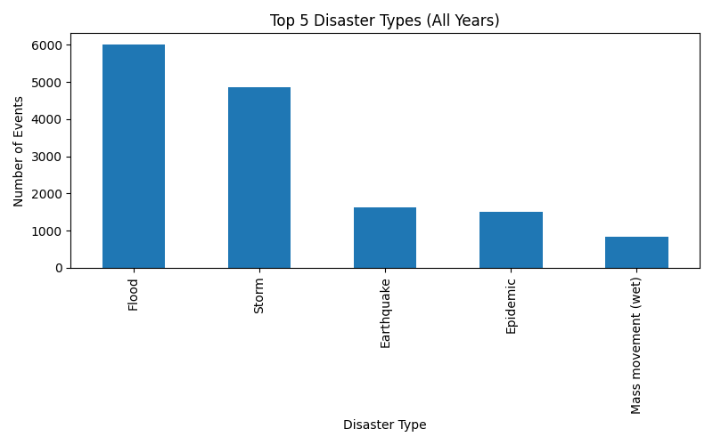

# 世界の災害の発生傾向と上位5災害タイプの分析

本レポートでは、EM-DATデータを用いて世界の災害発生状況を分析し、特に発生件数が多い上位5種類の災害に焦点を当てた。

## 1. 災害タイプ別の発生件数ランキング
以下のグラフは全期間における災害タイプ別の発生件数である。

最も多く発生した災害は **Flood** であった。
## 2. 上位5災害タイプの年別推移
次のグラフは、上位5災害タイプの発生件数を年ごとに表示したものである。

このグラフから、災害の発生件数は年によって大きく変動しており、
特定の災害タイプが時期によって増加または減少していることが読み取れる。

また、上位5災害タイプが全災害の大部分を占めていることがわかる。

## 3. 考察
- 災害の発生件数は長期的に増加傾向にある可能性が高い。
- 近年では特定の災害タイプのみを想定した対策では不十分となっている。
- **多様な災害を想定した総合的な防災・減災政策が必要と言える。**

今回の分析は全体傾向の把握であり、国・地域別の分析や気候変動との関連分析を追加することで、より深い災害リスクの理解が期待できる。
